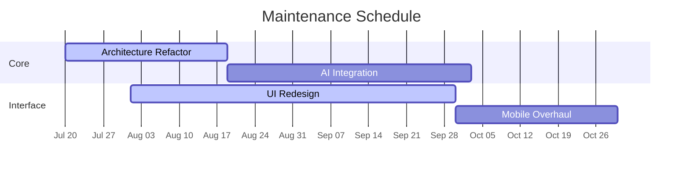

# 🚧 UNDER MAINTENANCE 🚧

> Major upgrade in progress - Expect version 5.0 with enhanced AI capabilities

**Status**: `Active Maintenance`  
**Estimated Completion**: 2025-11-20  
**Progress**: 
```diff
+ Completed [██████████░░░░░░░░░░░░] 40%
- Pending  [░░░░░░░░░░░░░░░░░░░░░░] 60%
```

## ⏳ Timeline


